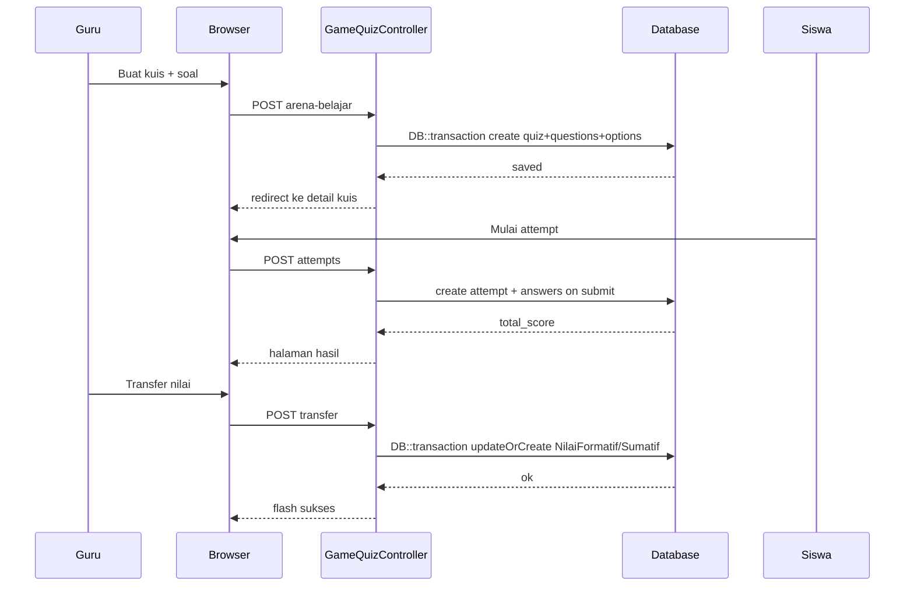
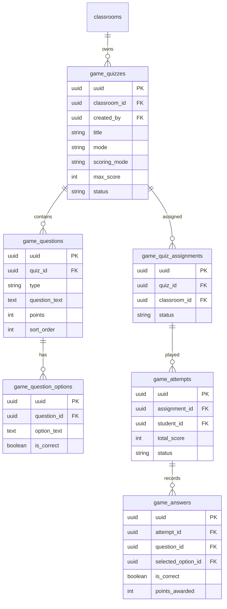

# PRD — Product Requirements Document

## 1. Overview

Guru di SIMS sudah bisa membuat tugas berlabel "kuis" di Ruang Kelas dan generate soal lewat Asisten AI, tapi siswa belum bisa mengerjakan kuis interaktif di dalam aplikasi — jawaban masih lewat unggah file, penilaian manual, dan tidak ada leaderboard atau umpan balik instan. Arena Belajar mengisi gap itu: modul kuis & game edukatif orisinal (terinspirasi mekanik Kahoot, Wordwall, dan pola UX game kasual) yang terintegrasi roster SIMS, auto-grading, dan pipeline nilai Kurikulum Merdeka. Penggunanya guru (buat & pantau), siswa (main & lihat skor), serta wali kelas/admin (monitor ringkas). Value utama: satu tempat dari buat soal → main → nilai rapor, tanpa akun platform eksternal.

## 2. Requirements

* **Multi-role & akses terkontrol:** Hanya guru pengampu / pengelola Ruang Kelas yang boleh buat & transfer nilai; siswa hanya attempt kuis kelasnya; admin/kepala boleh monitor sesuai permission existing.
* **Mobile-first & touch-friendly:** UI Alpine/Blade harus nyaman di Android mid-range (kelas 30–40 HP), karena mayoritas siswa main dari ponsel.
* **Async-first (koneksi 3T):** Fase 1–2 mengandalkan request HTTP + polling ringan, bukan WebSocket wajib — supaya tetap jalan di jaringan sekolah yang tidak stabil.
* **Auto-grading akurat:** Skor MCQ/Benar-Salah dihitung di server (bukan di client saja); mode Akurasi default untuk penilaian rapor, mode Kompetitif hanya untuk review.
* **Integrasi nilai Kurmer:** Hasil attempt bisa ditransfer ke Nilai Formatif/Sumatif lewat pola yang sama dengan transfer tugas Ruang Kelas, dengan audit trail.
* **Bahasa Indonesia & tanpa akun ekstra:** Semua label/pesan/validasi UI Bahasa Indonesia; siswa join via login SIMS (roster), bukan PIN/nickname anonim.

## 3. Core Features

Sesuai roadmap, fitur dikembangkan bertahap:

### Fase 1: Bank Soal & Kuis Async [High]
Guru membuat kuis interaktif (MCQ + Benar/Salah), menugaskan ke Ruang Kelas, siswa mengerjakan async, sistem auto-grade, hasil bisa ditransfer ke buku nilai.
* **Quiz Builder:** Form buat/edit kuis + soal + opsi, termasuk import dari output Asisten AI Guru.
* **Assign & Jadwal:** Set opens_at, due_at, max_score, scoring_mode, hide_scores, content lock opsional.
* **Attempt Engine:** Siswa jawab per-soal, submit sekali, skor dihitung server-side.
* **Monitor & Transfer Nilai:** Dashboard hasil per siswa/per soal + transfer ke Formatif/Sumatif.

### Fase 2: Live Session & Leaderboard [Medium]
Mode live-lite untuk review kelas: guru buka sesi, siswa ikut dari Ruang Kelas, leaderboard diperbarui lewat polling, plus tipe soal Match Up dan isian singkat.
* **Live Lobby:** Guru start/stop sesi; siswa melihat status & soal yang sedang aktif.
* **Leaderboard:** Podium real-time (polling) dengan mode Akurasi vs Kompetitif.
* **Match Up & Short Answer:** Pasangkan istilah–definisi; isian singkat dengan fuzzy match di server.
* **Notifikasi:** Opsional FCM “kuis live dimulai” ke anggota kelas.

### Fase 3: Template Interaktif & Mode Tim [Low]
Variasi template ala Wordwall dari bank soal yang sama, mode tim, cetak PDF, dan antrean offline untuk wilayah 3T.
* **Template Switcher:** Satu set konten → Quiz / Match / Flashcard / Crossword / Susun Kata.
* **Mode Tim:** Skor agregat per kelompok dalam sesi live.
* **Printable PDF:** Worksheet dari bank soal yang sama (DomPDF).
* **Offline Queue:** Attempt tersimpan lokal lalu sync saat online (best-effort).

## 4. User Flow

**Alur Guru:**
1. Buka Ruang Kelas → menu Arena Belajar → Buat Kuis.
2. Isi judul, mode skor, jadwal; tambah soal manual atau impor dari Asisten AI.
3. Simpan draft → Publikasikan / Assign ke rombel terkait.
4. (Opsional) Aktifkan content lock untuk ujian sumatif.
5. Pantau progress siswa di halaman Hasil (completion %, skor, akurasi per soal).
6. Transfer nilai ke Formatif (TP) atau Sumatif (Materi) bila siap masuk rapor.

**Alur Siswa:**
1. Login SIMS → Ruang Kelas → kartu Arena Belajar yang terbuka.
2. Mulai attempt (satu attempt aktif per assignment, sesuai aturan kuis).
3. Jawab soal satu per satu; lihat umpan balik instan bila guru mengizinkan.
4. Submit → lihat skor sendiri; leaderboard hanya jika guru enable.
5. Tidak bisa mengulang jika kuis sudah dikunci / attempt sudah submitted (kecuali guru reset).

**Alur Wali Kelas / Admin (monitor):**
1. Buka Arena Belajar di kelas terkait (read-only hasil).
2. Lihat ringkasan penyelesaian dan skor rata-rata.
3. Tidak mengubah soal atau mentransfer nilai kecuali punya akses manage Ruang Kelas / permission setara.

## 5. Architecture

Aplikasi ini monolith Laravel 12 + Blade + Alpine.js (bukan Inertia), selaras dengan stack SIMS existing. Server-rendered: controller menangani request, Eloquent ke MySQL/SQLite. Modul Arena Belajar hidup sebagai sibling Ruang Kelas (bukan mengubah skema `classroom_assignments`), reuse `ClassroomPolicy`, `HandlesContentLock`, `Audit::log()`, dan pola transfer nilai. Kalau multi-tenant `school_id` aktif di project, tabel game ikut trait `BelongsToSchool` + global scope.

## 6. Database Schema

Tabel utama beserta kolom:

* **game_quizzes** (definisi kuis / konten bank soal)
    * `uuid` (UUID): Primary Key — `HasUuids`.
    * `classroom_id` (UUID, FK → classrooms): Kelas asal pembuatan.
    * `created_by` (UUID, FK → users): Guru pembuat.
    * `title` (String): Judul kuis.
    * `instructions` (Text, nullable): Petunjuk rich text.
    * `mode` (String): `async` | `live` (default `async`).
    * `scoring_mode` (String): `accuracy` | `competitive` (default `accuracy`).
    * `max_score` (Integer): Skala nilai (mis. 100).
    * `hide_scores` (Boolean): Sembunyikan skor dari siswa sampai dibuka.
    * `show_leaderboard` (Boolean): Tampilkan podium.
    * `instant_feedback` (Boolean): Umpan balik benar/salah per soal.
    * `is_locked` (Boolean): Content lock / kiosk.
    * `access_token` (String, nullable): Token lock.
    * `opens_at`, `due_at` (Timestamp, nullable): Jadwal.
    * `status` (String): `draft` | `published` | `closed`.
    * `created_at`, `updated_at`, `deleted_at` (Timestamp): SoftDeletes.

* **game_questions** (soal dalam kuis)
    * `uuid` (UUID): Primary Key.
    * `quiz_id` (UUID, FK → game_quizzes).
    * `type` (String): `mcq` | `true_false` | `short_answer` | `match` (Fase 1: mcq + true_false).
    * `question_text` (Text): Teks soal.
    * `points` (Integer): Bobot soal (default proporsional ke max_score).
    * `sort_order` (Integer): Urutan tampil.
    * `meta` (JSON, nullable): Data tambahan (pasangan match, kunci short_answer, dsb.).
    * `explanation` (Text, nullable): Pembahasan setelah jawab.
    * `created_at`, `updated_at` (Timestamp).

* **game_question_options** (opsi jawaban MCQ/TF)
    * `uuid` (UUID): Primary Key.
    * `question_id` (UUID, FK → game_questions).
    * `option_text` (Text): Teks opsi.
    * `is_correct` (Boolean): Kunci jawaban (jangan expose ke siswa sebelum submit/feedback).
    * `sort_order` (Integer).
    * `created_at`, `updated_at` (Timestamp).

* **game_quiz_assignments** (penugasan kuis ke satu/lebih classroom)
    * `uuid` (UUID): Primary Key.
    * `quiz_id` (UUID, FK → game_quizzes).
    * `classroom_id` (UUID, FK → classrooms).
    * `opens_at`, `due_at` (Timestamp, nullable): Override jadwal per kelas.
    * `status` (String): `open` | `closed`.
    * `created_at`, `updated_at` (Timestamp).

* **game_attempts** (satu percobaan siswa per assignment)
    * `uuid` (UUID): Primary Key.
    * `assignment_id` (UUID, FK → game_quiz_assignments).
    * `student_id` (UUID, FK → users / id_login siswa): Pemain.
    * `total_score` (Integer): Skor akhir 0–max_score.
    * `correct_count` (Integer): Jumlah benar.
    * `status` (String): `in_progress` | `submitted` | `graded`.
    * `started_at`, `submitted_at` (Timestamp, nullable).
    * `duration_ms` (Integer, nullable): Untuk mode kompetitif.
    * `created_at`, `updated_at` (Timestamp).

* **game_answers** (jawaban per soal dalam attempt)
    * `uuid` (UUID): Primary Key.
    * `attempt_id` (UUID, FK → game_attempts).
    * `question_id` (UUID, FK → game_questions).
    * `selected_option_id` (UUID, nullable, FK → game_question_options).
    * `answer_text` (Text, nullable): Untuk short_answer / match payload.
    * `is_correct` (Boolean, nullable).
    * `points_awarded` (Integer): Poin didapat.
    * `answered_at` (Timestamp, nullable).
    * `created_at`, `updated_at` (Timestamp).

## 7. Tech Stack

Stack wajib (jangan diganti kecuali FL minta eksplisit):

* **Backend & Framework:** Laravel 12 (PHP 8.2+/8.3+), method `casts()` (bukan property `$casts`), scheduler di `routes/console.php` bila perlu auto-close kuis.
* **Frontend:** Blade + Alpine.js 3 + Tailwind CSS 4 (Vite 7) — interaktivitas attempt cukup dengan Alpine; tidak pakai Inertia/React di Fase 1–2.
* **Database:** MySQL/SQLite via Eloquent ORM + migration.
* **Primary Key:** UUID (`HasUuids` trait di semua model game_*).
* **Multi-tenant (kalau relevan di project):** `school_id` + trait `BelongsToSchool` + global scope — jangan filter manual di tiap controller.
* **Auth & Role:** Session auth SIMS existing + `ClassroomPolicy` / `GameQuizPolicy`; permission via pola `canAccess` / spatie bila sudah terpasang.
* **Audit trail:** `Audit::log()` / activitylog untuk create kuis, submit attempt, transfer nilai.
* **Realtime:** Fase 1 tidak ada; Fase 2 polling AJAX; Laravel Reverb opsional belakangan.
* **Notifikasi:** FCM existing (opsional Fase 2).
* **PDF (Fase 3):** DomPDF yang sudah ada di project.
* **UI Language:** Bahasa Indonesia (semua label, tombol, validasi, flash message).
